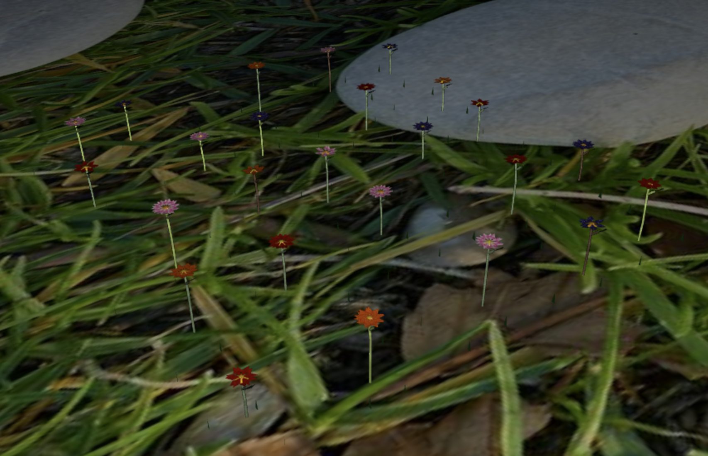
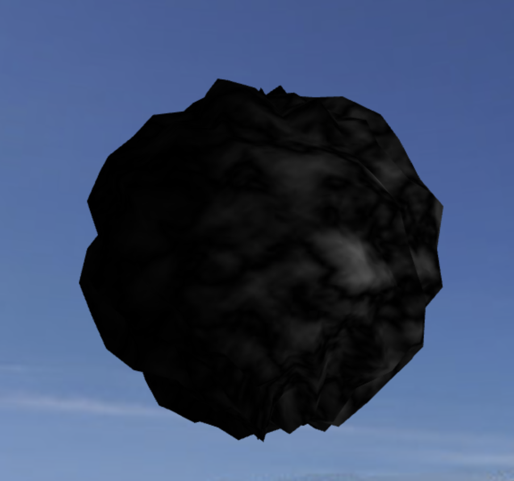
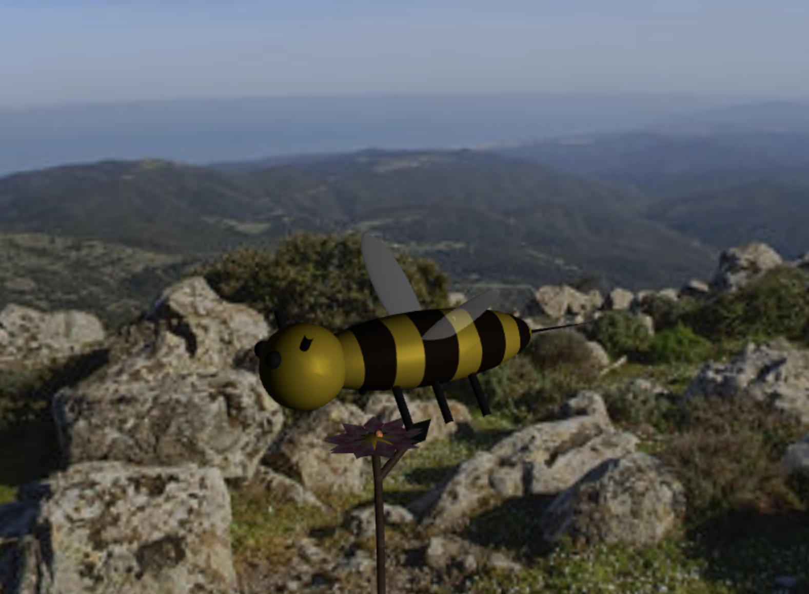
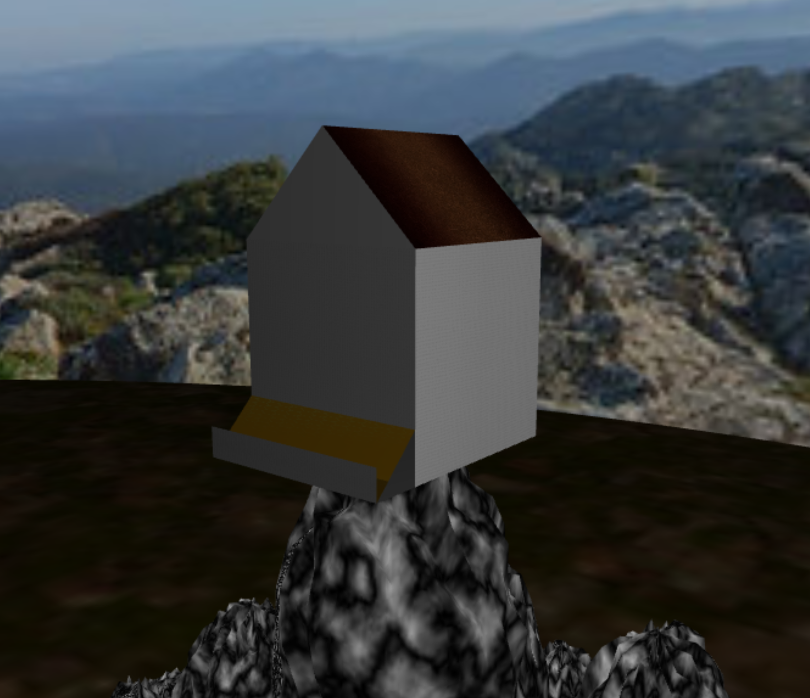
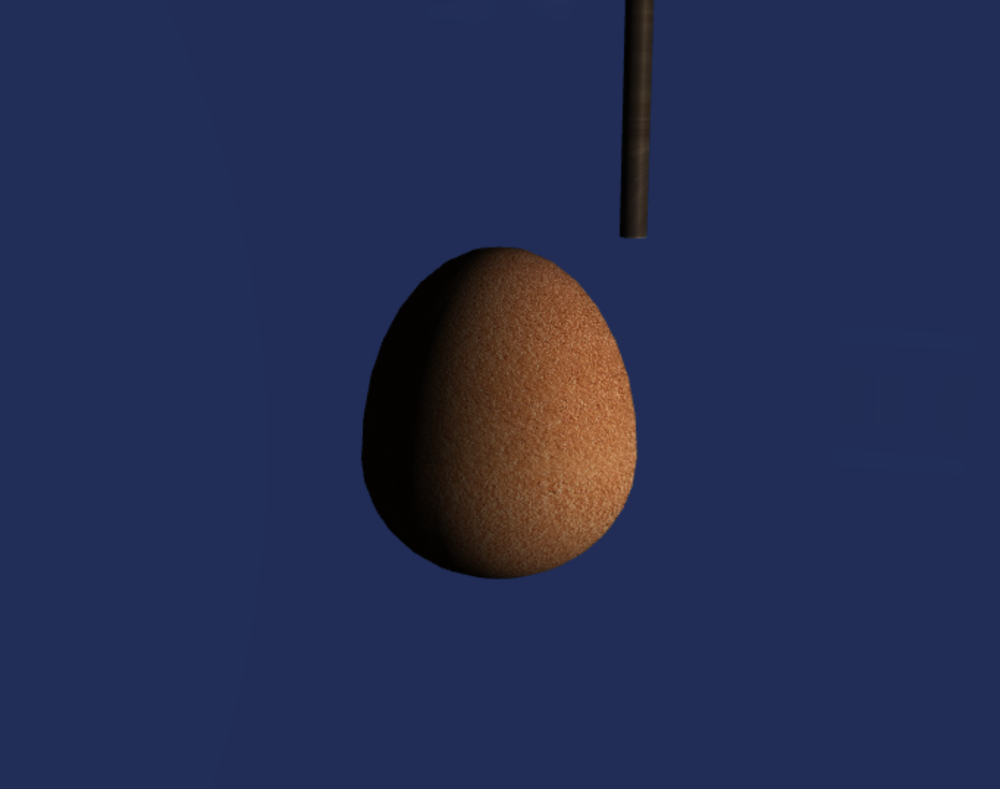
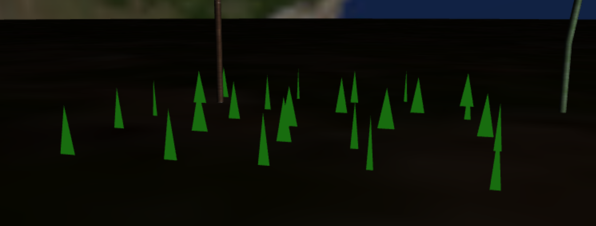
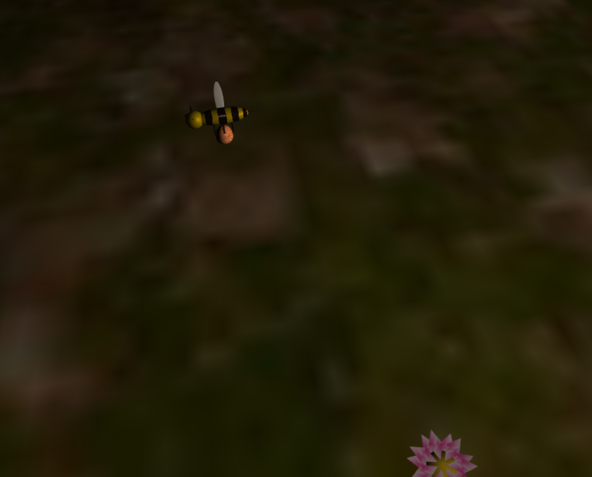

# Project Instructions CG-T01-G02

## Author 

- Luis Vieira Relvas (up202108661) cg-T01-G02

## Instructions 

All the requirements are developed having. For the aditional development I decided to choose the parabolic trajetory of the bee. 
Here are some screenshots: 

