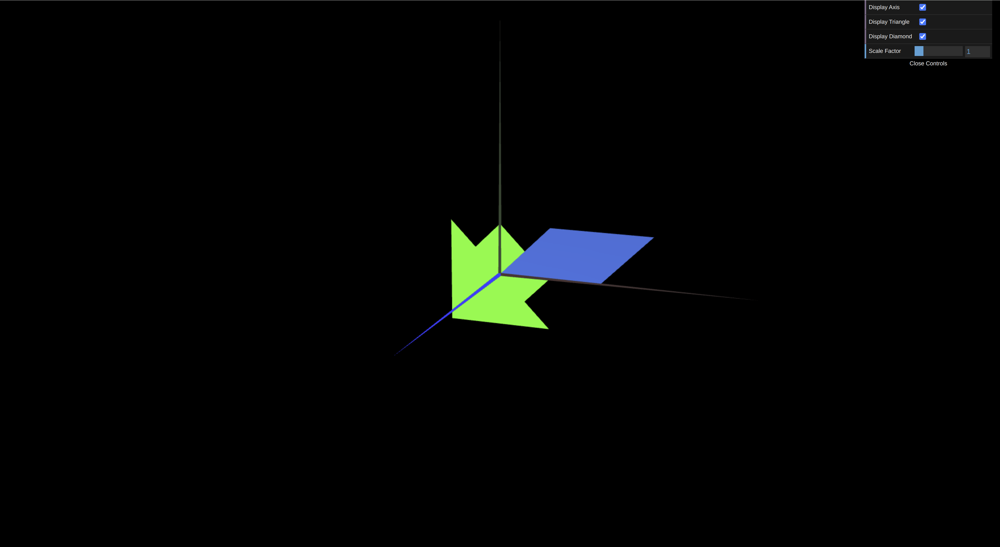
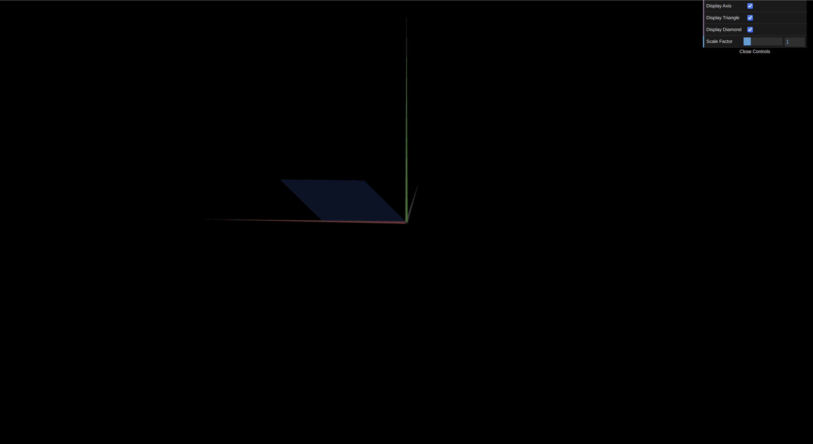
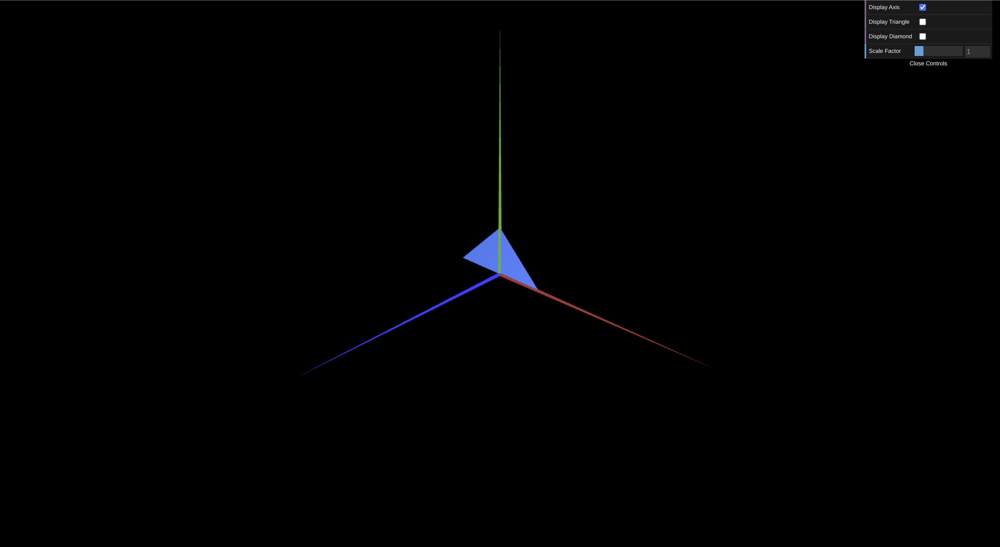
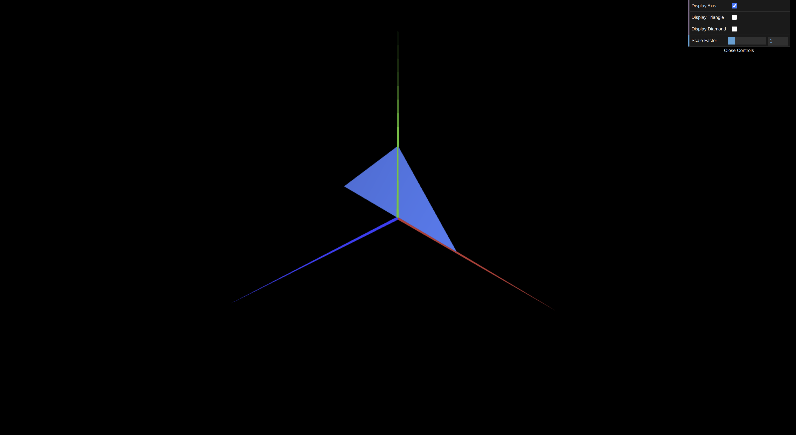

# CG 2023/2024

## Group T0xG0y

## TP 1 Notes

- No exercicio 1, tendo por base o código fornecido em "MyDiamond.js", conseguimos criar "MyTriangle.js" com as medidas pretendidas. Relativamente ao paralelogramo, divimo-lo em 4 triângulos : 1 em cada extermidade e 2 para formar o quadrado. 

- No exercicio 2, considerando que já tinhamos concluido com sucesso o myTriangle.js, não tivemos qualquer dificuldade em representar os dois triangulos com as medidas pretendidas.

