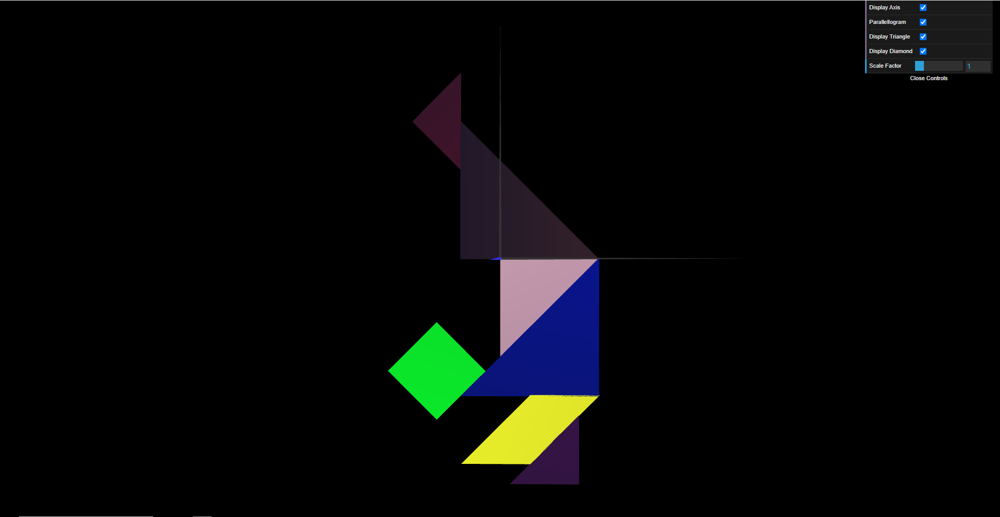
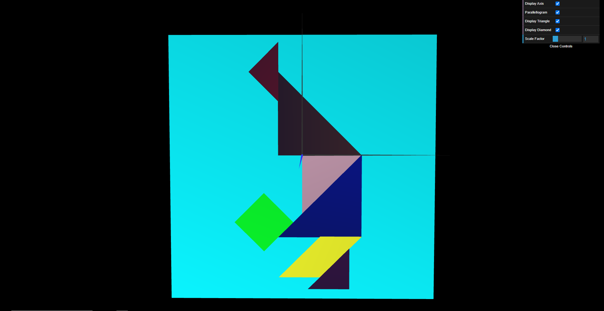
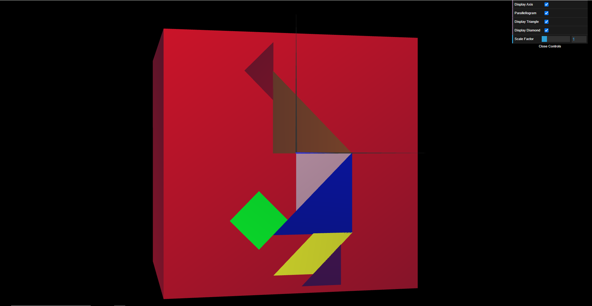

# CG 2023/2024

## Group T01G02

## TP 2 Notes

- No exercicio 1, usando as figuras criadas na TP1 e usando transformações geométricas criamos o Tangran pretendido. 

- No exercicio 2, conseguimos criar um cubo unitário e com transformações geométricas usa-lo como uma "base" do Tangran.

- No exercicio 3, criamos um plano unitário, depois repetimos 6 vezes e com transformações recriamos a "base" do exercicio anterior.

