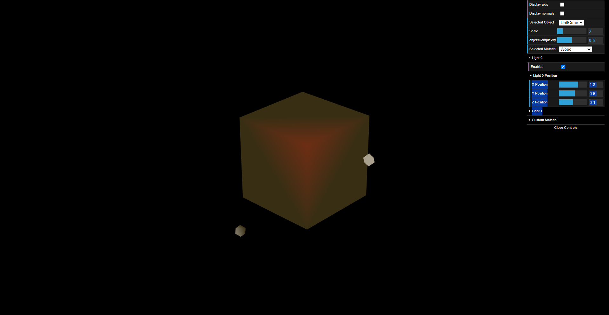
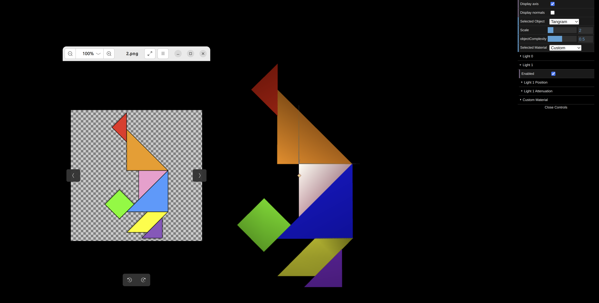
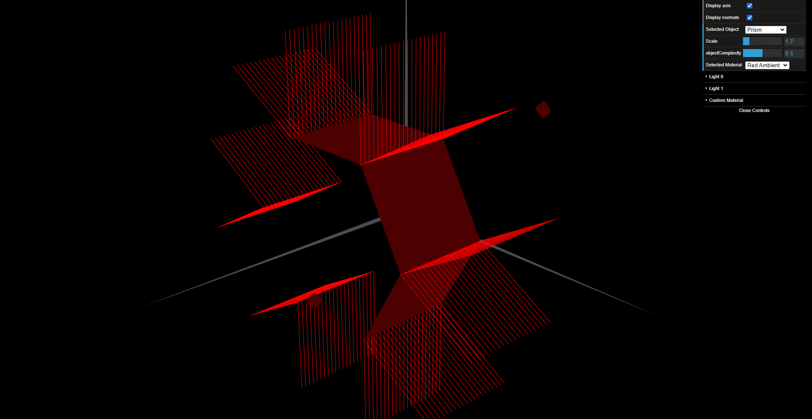
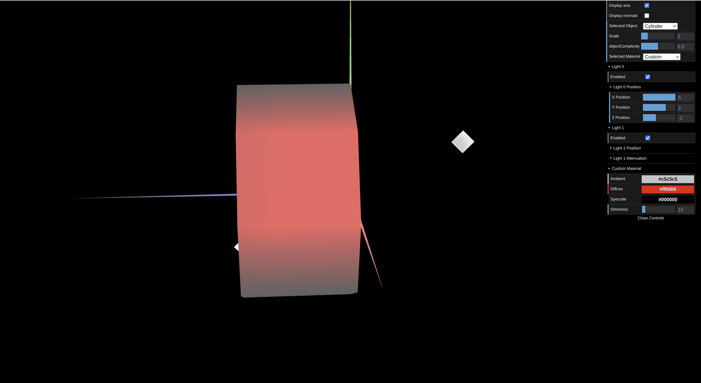

# CG 2023/2024

## Group T01G02

## TP 3 Notes

- No primeiro exercício, utilizamos as figuras construídas nas aulas TP1 e TP2 para determinar as normais adequadas. Isso foi crucial para calcular a luminosidade de forma precisa, levando em consideração o ângulo de incidência da luz e o ângulo de visualização. Para o material, escolhemos uma cor similar à madeira, com baixa componente especular como pedido no enunciado.

- No segundo exercício, desenvolvemos um prisma com um número variável de lados e graus de complexidade. O principal desafio foi implementar um algoritmo eficiente para a criação de vértices, descrição da malha de triângulos e cálculo das normais normalizadas em cada vértice. A iluminação aplicada foi similar ao método lecionado nas aulas teóricas, pois as normais em cada face do prisma são uniformes.

- No terceiro exercício, posicionamos as normais perpendicularmente a cada aresta do prisma. Essa estratégia possibilitou a redução do número de vértices e de normais a serem calculados. Como resultado, as transições de iluminação nas arestas foram suavizadas, tornando-as menos aparentes e conferindo um aspecto curvo à superfície do prisma.

