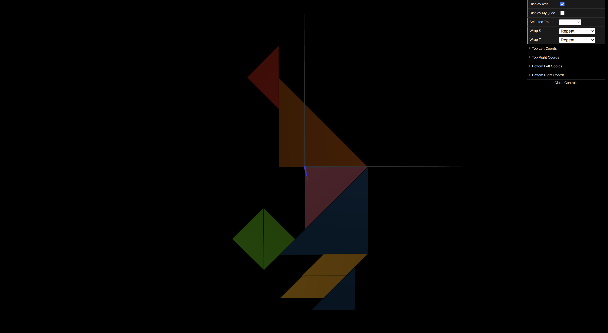
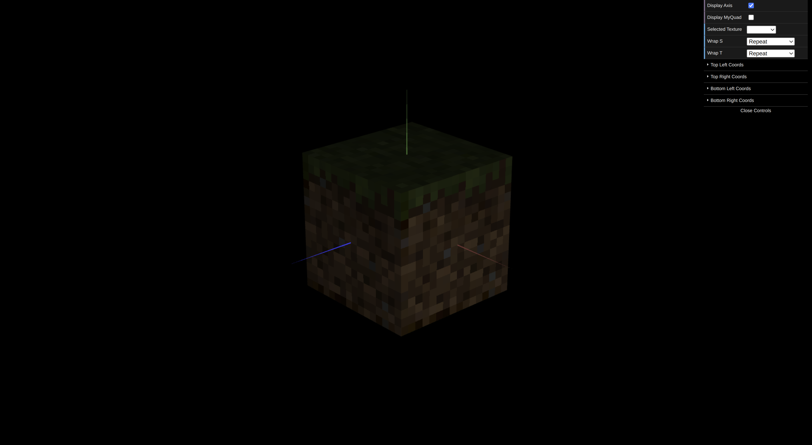

# CG 2023/2024

## Group T01G02

## TP 4 Notes

- No primeiro exercício, aplicamos a textura "tangram.png" a cada vértice de cada polígono da figura. O principal desafio foi determinar as coordenadas de textura para cada polígono e compreender a orientação dos eixos da textura. Para facilitar o processo, utilizamos a textura auxiliar "tangram-lines.png", que nos auxiliou na criação das partições necessárias.

- No segundo exercício, aplicamos textura a todos os quadrados da classe MyUnitCubeQuad implementada na TP2. A imagem da textura era menor que a área a cobrir, e o filtro linear padrão resultou em uma imagem desfocada. Para obter uma imagem nítida, alteramos o tipo de filtragem.

