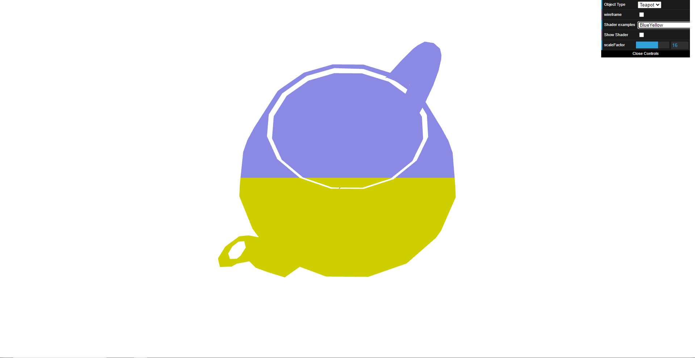
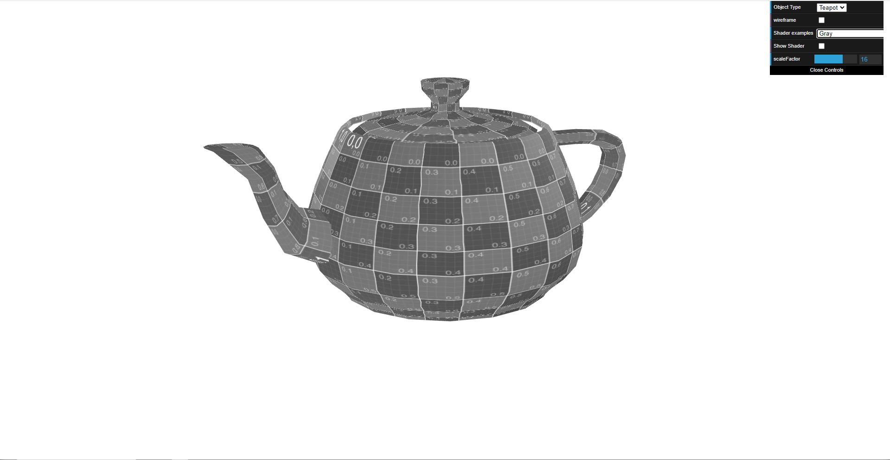
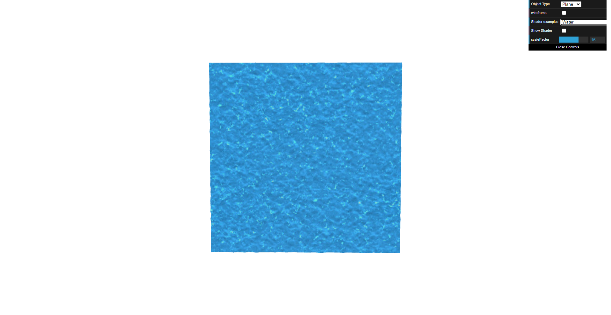

# CG 2023/2024

## Group T01G02

## TP 5 Notes

- No primeiro exercício, criamos ficheiros de vertex shadders e fragment shadders de forma a que os pontos da chaleira que satisfizessem a condição y>0.5 fossem da cor amarela e o resto da chaleira tive-se a cor azul. 

- No segundo exercício, usando a textura da Sépia do código fornecido, colorimos a chaleira com base na Grayscale, criando um fragment shadder para conseguir-mos produzir o efeito.

- No terceiro exercício criamos dois ficheiros baseados no texture2.vert e texture2.frag parar criarmos o efeito de água no plano fornecido, troca-mos as texturas da cena originais por waterTex.jpg e waterMap.jpg, usando o waterMap.jpg como um heightmap. Por fim, animamos os shadders criados de forma a criar um efeito semelhante ao do vídeo fornecido, uma espécie de efeito de ondas de águas

